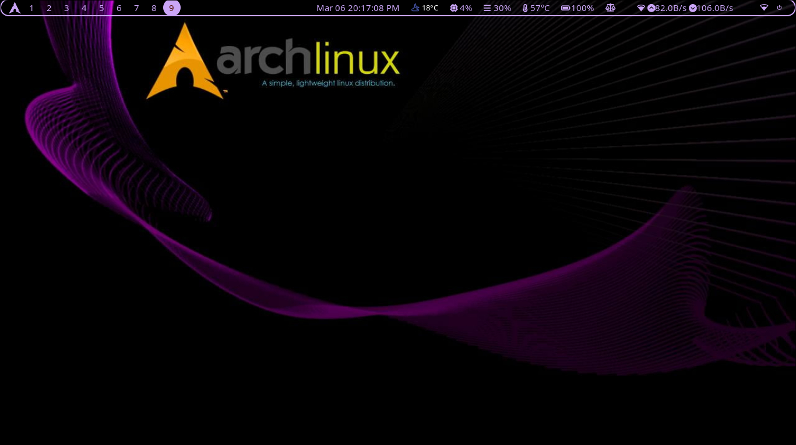

# MangoWC Dotfiles

  

Minimalist Mango Window Compositor on Arch Linux.

---

## ✨ Features
- **Dual Waybar:** Two Waybar setups featuring different workspace modules and weather widgets.
- **Animations:** Highly customized slide and zoom animations.
- **Blur & Shadows:** Custom blur parameters and drop shadows for floating windows.
- **Layouts:** Tile, scroller, grid, deck, monocle, and more.

## 📖 Documentation & Installation

For full instructions, keybinds, and Waybar configuration, please visit the **[Official Documentation Website](https://wgparch.codeberg.page/mangowc/)**.

## 📸 Screenshots

